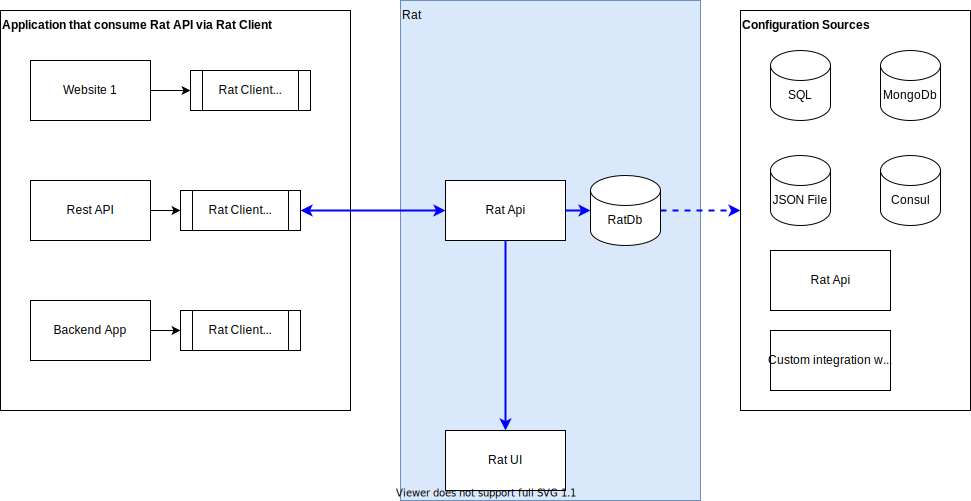

# :rat: Rat

The :rat: is configuration manager mediator that is capable of importing data from different sources.  
Currently: _JSON file_, _MongoDb_ and/or _evnironment variables_ with goal to extend that support towrads: _Consul_, _ETCD_, _MS SQL_ other :rat: instance(s) and probable some other sources.

# Motivation
Maintaing and handling configuration is one of more tedious and at some point complex problems that you need to resolve when building your application(s). Even if you have just one application the amount of configuration can be huge, or it can be just couple of keys and a connection string that after a few years become a page that requires a documentation!  
Now there are many ways to store your configuration entries if the file (e.g. appsettings.json) is becoming to cumbersome, you could just store it in a SQL table or MongoDb collection and be done with it, or go with enterprise solutions like [Consul](https://www.consul.io/docs/agent/kv.html) or [ETCD](https://etcd.io/). [Consul](https://www.consul.io/docs/agent/kv.html) even offers you a very nice [UI](https://learn.hashicorp.com/consul/getting-started/ui) for managing your configuration keys.  
So, why would I go and build yet another configuration manager?  
Well because I needed something simple - yet very extendable.  
I needed something that can have a lifecycle of a "simple" API.  
I needed something that is capable of importing configurations from different sources: files, databases, KV stores or even other APIs.  
I needed something that can fit into an already matured environment that has lots of different services: legacy, old and new that are going to be built.  
I needed something that will not require extra work, or huge refactoring in order to become a single source of truth.  

So, that's how the idea for :rat: came to life. 

# Architecture


# How it works?

The :rat: is build in C# using .net core 3.1 and it exposes a very simple API that currently offers only one method GET by key.
The configuration data can be imported from several sources:
* JSON file
* MongoDb Collection
* Environment Variables

## Importing configuration
No matter the source of configuration data the schema below needs to be respected, meaning the imported data needs to be deserializable into this object:
```c#
public class ConfigurationEntry
{
    public string Key { get; set; }

    public object Value { get; set; }

    public int Expiration { get; set; }
}
```
You can of course have additional properties, but these 3 are required minimum.

## Not all imports are born equal!
Every importer that you use requires to have a Rank specified. You can consider a rank as you would consider a weight when doing some load balancing scenarios.  
If you want to disable the importer than set the `Rank` value to be `0` and if you want to some rank to be executed last than let it have the biggest value between used importers.  
_Example:  
Let's say that we are using 2 importer: JSON and MongoDb and we want MongoDb importer to be executed first. All we need to to is make sure that MongoDb importer has smaller rank than JSON importer e.g. MongDb has rank of 1 and JSON a rank that equals to 2._  

>Rank can have the maximum value of: `int.MaxValue - 1`, because `int.Max` is reserved for Environment Variable importer so it is guaranteed it will be always executed last.  

### Importing from JSON file
Configuration specifed below will need to be provided inside the `appsettings.json`:
```json
"JsonFileStoreOptions": {
    "Rank": 1,
    "Path": "{some_path}\\{some_name}.json"
  }
```
There are just 2 settings:
* Path: the path to the JSON file that contains configuration that will be imported
* Enabled: if set to false importing will be skipped

The content of file should look similar to the example below:
```json
[
  {
    "Key": "A1",
    "Value": "Hallo File",
    "Expiration": 300
  },
  {
    "Key": "A2",
    "Value": "Hallo alo from File",
    "Expiration": 600
  }
]
```

### Importing from MongoDb
Configuration specifed below will need to be provided inside the `appsettings.json`:
```json
"MongoStoreOptions": {
  "Rank": 1,
  "MongoConnectionOptions": {
    "Name": "mongo",
    "Url": "mongodb://localhost:27017"
  },

  "MongoDatabaseOptions": {
    "Name": "{my_database}"
  },

  "MongoCollectionOptions": {
    "Name": "{my_collection}"
  }
}
```
Imported document will have auto-generated ObjectId which is only requried by MongoDb and its existence is of no consequence to :rat: 

### Importing from Environment Variables
There are two requirements:
* The envrinment names must start with: `RAT_`. The casing of the prefix is not important. 
* The value must be base64 encoded and must contain a valid JSON that complies with ConfigurationEntry model

To be OS agnostic :rat: reads only environment variables that belong to the process, so if you are specifying: System or User variables on Windows they will not be picked up. The easy an unobtorsive way of specifying variables in Windows for Visual Studio users is adding them in `launchSettings.json` in your project, or if you are using Docker or Docker-Compose try [this](https://docs.docker.com/engine/reference/commandline/run/#set-environment-variables--e---env---env-file) or [that](https://docs.docker.com/compose/environment-variables/).  
What is important to know is that the value of the environment variable will always override the other value imported previously if they have the matching keys!  
To be more clear let's observe this on a simple example.  
Let's say that we are importing configurations from 2 sources: MongoDb and Environment variables. MongoDb values will be imported first and let's say we have ended up with 3 configuration entries with keys: `A`, `B` and `C`. After the MongoDb import is finished :rat: will start importing values from the environment variables and if there is an environment variable with name: `RAT_A` or `RAT_B` or `RAT_C` its value will override whatever was imported from MongoDb.  

## TO DOs
There are several things that I would like to address in hopefully recent future:
* Add ability to "plug in" an importer by offering a resuable core so one can quicily build its own API on top of it
* Thick client - that will have configurable caching capabilities and could be distributed as a Nuget package
* Benchmarks to figure out the capabilities of the API.
